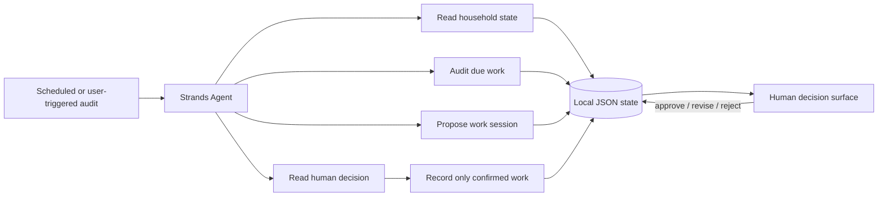

# HomeOps Quiet Agent

HomeOps Quiet Agent is a human-supervised household-maintenance agent built with the **Strands Agents SDK** for the **Agents for Humans Hackathon**.

It handles the repetitive work people usually neglect:

- reads the household maintenance record;
- calculates overdue and upcoming work;
- groups urgent tasks into a realistic session;
- presents one decision instead of another dashboard to manage;
- waits for explicit human approval;
- records completed work only after the person confirms it.

The goal is quiet automation: the agent does the tracking and planning in the background, then interrupts the person only when a meaningful choice is required.

## Track

**Everyday Agents**

## Why this is an agent rather than a reminder app

A calendar can tell someone that a dryer vent is due. HomeOps reasons across the whole household:

1. What is overdue?
2. What is due soon?
3. What can fit into the person's available time?
4. Which tasks belong together?
5. What requires a human decision?
6. What state should be updated after confirmed work?

The proposal is stored as shared state. The agent must stop after proposing and use a separate tool to read the human's decision. Recording physical work and adding durable responsibilities both have explicit confirmation gates.

## Architecture



A browser interface from the companion HomeOps project can visualize the same proposal-and-approval model. The Strands implementation in this directory is self-contained and uses a JSON store so the workflow is easy to run and inspect.

## Strands tools

| Tool | Purpose | Changes state? |
| --- | --- | --- |
| `get_home_state` | Read items, proposal, and activity | No |
| `audit_due_work` | Find overdue/upcoming maintenance | No |
| `lookup_maintenance_item` | Retrieve one item's history and due date | No |
| `propose_work_session` | Create a time-bounded proposal | Yes, proposal only |
| `read_human_decision` | Read approval/revision/rejection | No |
| `record_confirmed_service` | Record work after explicit confirmation | Yes |
| `add_confirmed_responsibility` | Add recurring work after explicit confirmation | Yes |

## Requirements

- Python 3.10+
- `strands-agents`
- For the AWS path: configured AWS credentials and access to the selected Amazon Bedrock model
- For the no-cost local path: Ollama with a local model

## Setup

```bash
cd agents-for-humans
python -m venv .venv
source .venv/bin/activate
# Windows: .venv\Scripts\activate
pip install -r requirements.txt
```

## Run with Amazon Bedrock

```bash
export HOMEOPS_MODEL_PROVIDER=bedrock
export AWS_REGION=us-west-2
export BEDROCK_MODEL_ID=us.amazon.nova-lite-v1:0

python homeops_agent.py \
  "Audit my home for the next 30 days. Propose the best session under 60 minutes, then stop for approval."
```

## Run locally without a paid API

Install and start Ollama, then:

```bash
ollama pull qwen3:4b
export HOMEOPS_MODEL_PROVIDER=ollama
export OLLAMA_MODEL_ID=qwen3:4b

python homeops_agent.py \
  "Audit my home for the next 30 days. Propose the best session under 60 minutes, then stop for approval."
```

## Deterministic offline proof

The domain workflow can be tested without any model credentials:

```bash
python homeops_agent.py --offline-demo
```

This is not a substitute for the Strands agent. It proves that the persistence, due-date calculations, time-budgeting, proposal state, and confirmation gates used by the agent tools work independently.

## Tests

```bash
python -m unittest -v test_homeops_core.py
```

The test suite covers:

- urgency ordering;
- time-budgeted proposals;
- persistent human decisions;
- confirmation requirements;
- due-date updates;
- duplicate protection.

## Safety and privacy

- Household state stays in a local JSON file by default.
- The agent may propose work but cannot approve its own proposal.
- Physical service cannot be marked complete without `confirmed_by_human=True`.
- New recurring responsibilities require the same explicit confirmation.
- The system does not purchase supplies, hire contractors, or handle payment information.

## Files

- `homeops_agent.py` — Strands agent, tools, provider selection, and CLI
- `homeops_core.py` — tested persistence and domain rules
- `data/homeops.json` — editable sample household state
- `test_homeops_core.py` — zero-dependency unit tests
- `architecture.mmd` — architecture diagram source

## License

MIT
